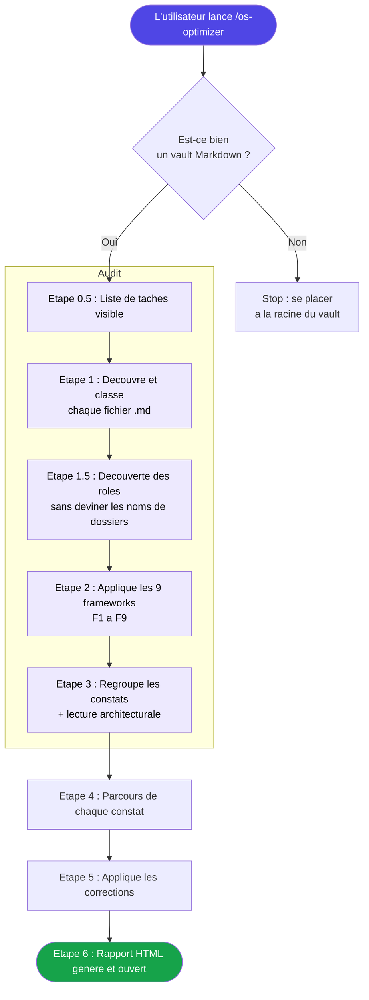
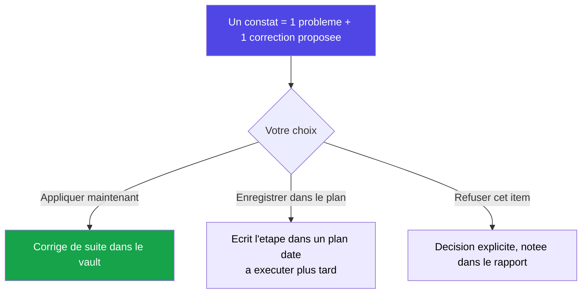

<div align="center">


<a href="https://github.com/Kaaramo/AI5D-OS-OPTIMISEUR">
  
</a>

<br/>


<br/>


</div>

---

<div align="center">

### Gardez votre vault Obsidian propre, cohérent et lisible par votre IA, sans effort manuel.

Une skill qui audite chaque fichier Markdown de votre vault contre 9 frameworks éprouvés, puis vous propose une correction concrète pour chaque problème détecté.

</div>

---

## Le problème

Un second cerveau vivant se dégrade lentement, sans que personne ne le remarque :

- Les notes se **dupliquent** et finissent par **se contredire** d'un fichier à l'autre.
- Certains fichiers deviennent **trop longs** et noient l'information utile.
- Les liens `[[...]]` **cassent**, des notes deviennent **orphelines** et introuvables.
- Les `CLAUDE.md` deviennent **bavards**, les tables de routage **mentent** sur la réalité des dossiers.

Conséquence directe : quand votre assistant IA travaille dans ce vault, il lit du bruit, rate le contexte important, et vous rend des réponses génériques. Un vault en désordre, c'est une IA qui se trompe.

## La solution

**AI5D OS Optimiseur** inspecte l'intégralité de votre vault et transforme le désordre en système propre, en vous gardant aux commandes.

La skill ne se contente pas de signaler : pour **chaque** problème elle **rédige une correction concrète**, puis vous laisse décider, item par item, de l'appliquer maintenant ou de la planifier. À la fin, elle produit un **rapport HTML** clair, groupé par framework.

> En une phrase : rien n'est juste « signalé puis oublié ». Chaque constat se termine par une correction appliquée, planifiée, ou refusée en connaissance de cause.

---

## Pour qui

<div align="center">

| Profil | Ce que l'optimiseur apporte |
|:---|:---|
| **Solopreneur, freelance, consultant** | Un second cerveau qui reste lisible et fiable au fil des mois. |
| **Équipe, PME, agence** | Un OS d'organisation cohérent : routage à jour, zéro doublon, navigation claire. |

</div>

## Bénéfices clés

- **Chaque problème a une solution** : aucun simple signalement, aucun « à corriger plus tard ».
- **Vous gardez le contrôle** : pour les corrections sensibles (fusions, réécritures, réorganisations), vous choisissez la cible et la formulation, une par une.
- **Aucun nom de dossier imposé** : l'optimiseur découvre votre structure réelle avant tout audit, il ne plaque jamais un schéma.
- **Progression visible** : chaque étape et chaque framework apparaissent comme une tâche que vous voyez avancer.
- **Pensé pour l'IA** : il vérifie aussi la chaîne de découverte que suit votre assistant (CLAUDE.md racine, routage, index de dossier, fichier).

---

## Les 9 frameworks

Chaque fichier est passé devant 9 grilles d'analyse complémentaires.

<div align="center">

| Code | Framework | Ce qu'il vérifie |
|:---:|:---|:---|
| **F1** | Anthropic CLAUDE.md | Qualité des instructions, précision, élagage |
| **F2** | Karpathy Wiki | Liens `[[...]]` cassés, pages orphelines, schéma |
| **F3** | Caveman | Compression : trop bavard, mots de remplissage |
| **F4** | Chroma Context Rot | Fichiers trop longs, info mal placée, distracteurs |
| **F5** | Anthropic Memory | Taille des fichiers, noms descriptifs, index |
| **F6** | Progressive Disclosure | Structure et frontmatter des `SKILL.md` |
| **G7** | Hygiène générale | Tirets, frontmatter, titres dupliquant le nom |
| **F8** | Réflexion | Doublons et contradictions entre fichiers |
| **F9** | Architecture | Navigation du vault, routage, découvrabilité |

</div>

---

## Comment ça marche

Sept étapes, de la vérification initiale jusqu'au rapport.



<br/>

<details>
<summary><b>Étape 1.5 : Découverte des rôles (le principe clé)</b></summary>

<br/>

Avant tout audit, l'optimiseur lit le contenu de vos dossiers pour **comprendre leur rôle** (couche de contexte, de décisions, de notes quotidiennes, convention d'index...). Il ne suppose jamais un nom de dossier. Le vault d'un utilisateur s'appelle `Context/`, celui d'un autre `About/` ou `Me/` : chaque framework raisonne sur les **rôles découverts**, pas sur des noms codés en dur.

</details>

<details>
<summary><b>Étape 2 : Les 9 frameworks appliqués avec jugement</b></summary>

<br/>

Pour chaque framework, l'agent lit son fichier d'implémentation de passe, exécute chaque vérification, puis **lit le contexte et raisonne** au lieu de simplement matcher un motif. Un fichier de 200 Ko est un problème pour un `CLAUDE.md`, mais parfaitement normal pour une transcription. Chaque constat embarque un raisonnement propre au cas.

</details>

<details>
<summary><b>Étape 4 : Le parcours, chaque problème a une solution</b></summary>

<br/>

C'est le cœur de la skill. Pour **chaque** constat, vous tranchez :



Les corrections purement mécaniques (tirets, titres dupliqués) peuvent s'appliquer en lot. Tout ce qui est sémantique (fusion, réécriture de routage, réorganisation) se fait pas à pas, avec vous qui confirmez la cible.

</details>

<details>
<summary><b>Étape 6 : Le rapport HTML</b></summary>

<br/>

Un tableau de bord groupé par framework : une lecture architecturale de votre vault en tête, puis le détail des constats par framework (sévérité, chemin, extrait, action, citation du framework). La liste complète est aussi enregistrée en JSON. Le HTML n'est jamais collé dans le chat : seulement son chemin et un résumé d'un paragraphe.

</details>

---

## Structure du dépôt

```
AI5D-OS-OPTIMISEUR/
├── README.md            Ce document
├── SKILL.md             Definition complete de la skill (les 7 etapes et leur logique)
└── references/          Le pourquoi et le comment de chaque framework
    ├── anthropic-claude-md.md          F1 : le pourquoi
    ├── passes-anthropic-claude-md.md   F1 : le comment (la passe)
    ├── karpathy-llm-wiki.md            F2 : le pourquoi
    ├── passes-karpathy-wiki.md         F2 : la passe
    ├── caveman-compression.md          F3 : le pourquoi
    ├── passes-caveman.md               F3 : la passe
    ├── chroma-context-rot.md           F4 : le pourquoi
    ├── passes-chroma-context-rot.md    F4 : la passe
    ├── anthropic-managed-memory.md     F5 : le pourquoi
    ├── passes-anthropic-memory.md      F5 : la passe
    ├── progressive-disclosure.md       F6 : le pourquoi
    ├── passes-progressive-disclosure.md F6 : la passe
    ├── passes-general-hygiene.md       G7 : la passe
    ├── anthropic-dreams.md             F8 : le pourquoi
    ├── passes-reflection.md            F8 : la passe
    ├── anthropic-architecture.md       F9 : le pourquoi
    ├── passes-architecture.md          F9 : la passe
    └── practitioner-notes.md           Notes de terrain inter-createurs
```

> Chaque framework sépare le **pourquoi** (la recherche qui le justifie) du **comment** (le fichier de passe avec les vérifications et le format des constats).

---

## Compatibilité et technologies

<div align="center">


<br/><br/>


</div>

---

## Installation et lancement

1. Placez ce dossier comme skill dans votre environnement.
2. Ouvrez un terminal **à la racine de votre vault** (le dossier qui contient votre `CLAUDE.md`).
3. Lancez la commande :

```
/os-optimizer
```

L'optimiseur vérifie d'abord qu'il est bien dans un vault, découvre votre structure, puis vous accompagne dans la revue de chaque correction.

> Conseil : la première exécution sur un vault existant est un gros nettoyage. Ensuite, un passage **mensuel** suffit pour rattraper la dérive (doublons, contradictions, fichiers devenus trop gros).

**Déclencheurs en langage naturel :** `optimise mon vault`, `audit de mon second cerveau`, `nettoie mon vault`, `vérifie l'architecture de mes notes`.

---

<div align="center">

### Un vault audité aujourd'hui, c'est une IA qui vous comprend demain.

<br/>


<br/>

<sub>© AI5D. Tous droits réservés.</sub>


</div>
